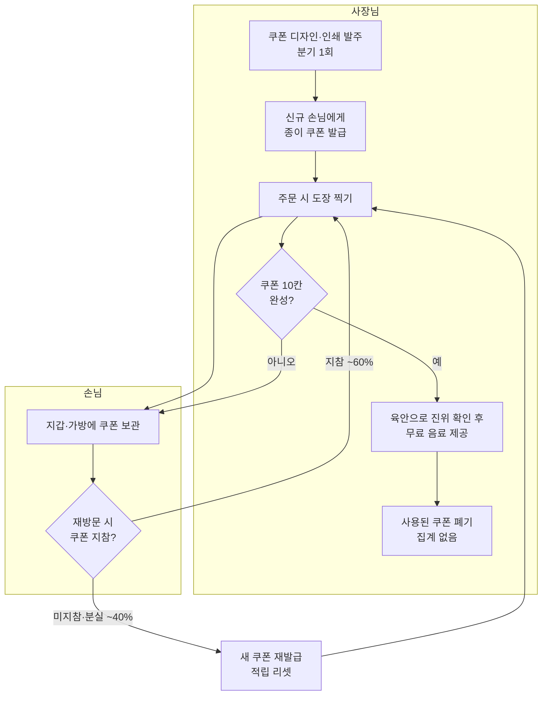
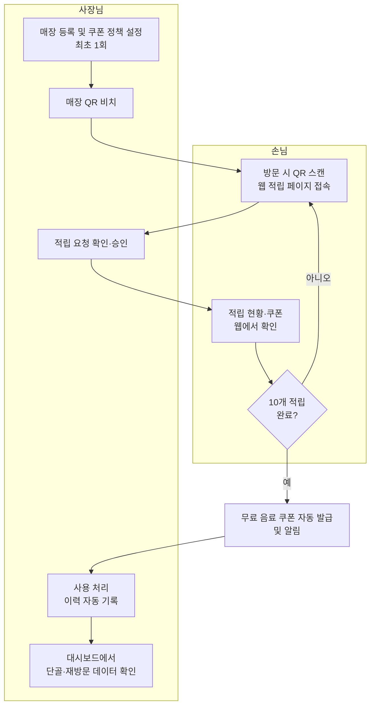

# 단골도장 AS-IS / TO-BE 프로세스 분석서

| 문서 버전 | 작성일 | 작성자 | 상태 |
|---|---|---|---|
| v1.0 | 2026-07-02 | 박효균 | Draft |

## 1. 분석 개요

### 1.1 분석 대상

동네 1인 카페 사장님이 **종이 쿠폰과 수기 도장**으로 단골 고객의 재방문을 관리하는 현행 프로세스. 쿠폰 제작 → 발급 → 도장 적립 → 손님 보관 → 리워드 사용 → 사후 집계까지의 전체 여정을 다룬다. 행위자(Actor)는 두 명이다: **사장님**(발행·적립·사용 처리)과 **손님**(보관·제시).

### 1.2 분석 방법

- 데스크 리서치(Desk Research): 소상공인 종이 쿠폰 운영 사례, 프랜차이즈 멤버십 솔루션 비교.
- 자체 경험: 카페 이용자 관점의 쿠폰 보관·분실 경험.
- **한계**: 사이드 프로젝트 특성상 실측 데이터가 없어, 소요 시간·발생 빈도 등 수치는 **합리적 추정치(estimate)**다. 추정 근거는 각 표에 명시했다. 5단계 이전에 실제 카페 1곳 인터뷰로 검증하는 것을 권장한다.

> **비대화형 실행 가정(Assumptions)**: 본 문서는 사용자 인터뷰 없이 작성되어 다음을 가정했다.
> 1. 대상 매장은 좌석 20석 이하, 사장님 1인 운영(아르바이트 0~1명)의 개인 카페.
> 2. 쿠폰 정책은 "도장 10개 적립 시 음료 1잔 무료"의 일반적 형태.
> 3. 일 평균 방문 손님 ~80명, 그중 쿠폰 적립 시도는 ~30건(약 40%)으로 추정.
> 4. 손님은 스마트폰을 보유하고 QR 스캔이 가능하다(예외는 §5 범위 밖에서 다룸).

## 2. AS-IS 현행 프로세스

### 2.1 프로세스 흐름도

### 2.2 단계별 상세

| # | 단계 | 행위자(Actor) | 사용 도구 | 소요 시간 | 문제점 |
|---|---|---|---|---|---|
| 1 | 쿠폰 디자인·인쇄 발주 | 사장님 | 인쇄소, 문방구 | 분기 1회 약 2시간 + 인쇄비 연 5~10만 원 (추정) | 재고 관리 필요, 디자인 변경 시 기존 쿠폰 폐기 |
| 2 | 신규 손님에게 쿠폰 발급 | 사장님 | 종이 쿠폰 | 건당 ~10초 | 피크타임에 안내 누락, 발급 여부 기억 불가 |
| 3 | 주문 시 도장 적립 | 사장님 | 고무 도장 | 건당 ~10초, 손님이 쿠폰 찾는 대기 20~30초 추가 (추정) | 피크타임 병목, 위조·중복 도장 검증 불가 |
| 4 | 쿠폰 보관 | 손님 | 지갑·가방 | — | 분실·훼손 잦음(재방문 시 미지참·분실 ~40% 추정) |
| 5 | 완성 쿠폰 확인·리워드 제공 | 사장님 | 육안 확인 | 건당 ~30초 | 도장 진위 판별 불가, 정책(유효기간 등) 구두 분쟁 |
| 6 | 사용 쿠폰 폐기·집계 | 사장님 | 없음 (대부분 미집계) | 0분 (수행 안 함) | 발행·적립·사용 데이터가 전혀 남지 않음 |

### 2.3 Pain Point 정의

| ID | Pain Point | 발생 단계 | 근거 (정량/정성) | 원인 분석 (Why) | 심각도(H/M/L) |
|---|---|---|---|---|---|
| PP-001 | 쿠폰 분실 시 적립이 리셋되어 손님의 재방문 동기가 소멸한다 | 4 | 재방문 시 미지참·분실 ~40% 추정. 적립 6~7개 상태에서 분실하면 재적립 포기 경향(정성) | 왜 리셋되나 → 적립 기록이 종이 실물에만 존재 → 왜 실물에만 있나 → 손님별 기록을 남길 저장 수단이 없음 | H |
| PP-002 | 사장님이 누가 단골인지, 재방문율이 얼마인지 데이터로 알 수 없다 | 6 | 발행 수·적립 수·사용 수 모두 미집계(현행 0건 기록) | 왜 모르나 → 집계를 안 함 → 왜 안 하나 → 수기 집계는 건당 기록 비용이 커서 1인 운영에서 현실적으로 불가능 | H |
| PP-003 | 피크타임에 도장 적립이 병목이 되거나 누락된다 | 2, 3 | 건당 10초 + 쿠폰 찾기 대기 20~30초 × 일 ~30건 = 일 15~20분 손실 (추정) | 왜 오래 걸리나 → 손님이 실물 쿠폰을 꺼내 사장님이 찍어야 함 → 왜 실물이 필요하나 → 적립 매체가 물리적 종이뿐 | M |
| PP-004 | 도장 위조·중복 날인을 검증할 방법이 없다 | 3, 5 | 시중 고무도장은 문방구에서 동일품 구매 가능(정성). 소상공인 커뮤니티에서 위조 사례 반복 보고 | 왜 검증 불가인가 → 도장 자체에 식별 정보가 없음 → 왜 없나 → 종이+도장 방식은 발급·적립 이력이 어디에도 남지 않음 | M |
| PP-005 | 쿠폰 인쇄 비용과 재고·발주 관리 부담이 있다 | 1 | 인쇄비 연 5~10만 원 + 분기 1회 ~2시간 (추정) | 왜 비용이 드나 → 실물 매체를 계속 소모 → 왜 소모형인가 → 사용 완료 쿠폰은 폐기되는 1회성 매체 | L |
| PP-006 | 손님이 쿠폰 소지를 잊으면 그 방문의 적립을 포기해야 한다 | 3, 4 | 미지참 방문은 적립 불가(나중에 소급 불가). "다음에 두 개 찍어줄게" 식 구두 약속은 분쟁 소지(정성) | 왜 소급이 안 되나 → 방문 사실을 증빙할 기록이 없음 → 원인은 PP-001과 동일: 기록이 실물에만 존재 | M |
| PP-007 | 쿠폰 정책(유효기간, 1일 적립 한도)이 명문화되지 않아 구두 분쟁이 생긴다 | 5 | 정책이 쿠폰 뒷면 소형 문구 또는 구두 안내뿐(정성) | 왜 분쟁이 되나 → 정책이 시스템으로 강제되지 않고 사람의 기억·재량에 의존 | L |

(심각도 기준: H = 프로세스 중단 또는 큰 비용, M = 반복적 비효율, L = 불편)

## 3. TO-BE 개선 프로세스

### 3.1 설계 원칙

1. **기록은 실물이 아닌 서버에**: 적립·사용 이력을 디지털로 남겨 분실·위조·미집계 문제를 구조적으로 제거한다.
2. **손님은 앱 설치 없이(웹)**: QR 접근만으로 적립·확인이 끝나야 한다. 설치 요구는 1인 카페 손님에게 과한 마찰이다.
3. **사장님 동작은 현행 도장보다 빠르거나 같아야 한다**: 디지털 전환이 피크타임 병목을 키우면 실패다.

### 3.2 프로세스 흐름도

### 3.3 단계별 상세

| # | 단계 | 행위자 | 변경 내용 (AS-IS 대비) | 해소하는 PP |
|---|---|---|---|---|
| 1 | 매장 등록·쿠폰 정책 설정 (최초 1회) | 사장님 | 인쇄 발주 대체. 유효기간·적립 한도 등 정책을 시스템에 명문화 | PP-005, PP-007 |
| 2 | 매장 QR 비치 | 사장님 | 종이 쿠폰 발급 단계 제거. 신규·기존 손님 구분 없이 동일 진입점 | PP-005 |
| 3 | 손님 QR 스캔 → 웹 적립 요청 | 손님 | 지갑에서 쿠폰 찾는 행위 제거. 앱 설치 불필요 | PP-003 |
| 4 | 적립 승인 | 사장님 | 도장 날인 대체. 적립 이력이 서버에 기록되어 위조·중복 검증 가능 | PP-003, PP-004 |
| 5 | 적립 현황·쿠폰 웹 확인 | 손님 | 실물 보관 불필요 — 분실·미지참 개념 자체가 사라짐 | PP-001, PP-006 |
| 6 | 완성 시 쿠폰 자동 발급·알림 | 시스템 | 육안 확인 대체. 완성 판정과 알림이 자동으로 이뤄짐 (알림 수단은 3단계에서 확정) | PP-004, PP-007 |
| 7 | 사용 처리·이력 기록 | 사장님 | 폐기 대신 사용 이력 자동 저장 | PP-002, PP-004 |
| 8 | 대시보드로 단골·재방문 확인 | 사장님 | 신규 단계. 발행·적립·사용 데이터 집계 자동화 | PP-002 |

> TO-BE는 기술 구현을 확정하지 않는다. "적립 승인"의 구체 방식(사장님 화면 탭 승인인지, 매장 코드 입력인지)과 알림 채널은 3단계 상세 기획에서 결정한다.

### 3.4 Pain Point 해소 매핑

| PP ID | AS-IS 문제 | TO-BE 해소 방안 | 해소 수준 (완전/부분/범위 밖) |
|---|---|---|---|
| PP-001 | 쿠폰 분실 → 적립 리셋 | 적립 기록을 서버 보관, 실물 매체 제거 | 완전 |
| PP-002 | 단골·재방문 데이터 부재 | 적립·사용 이력 자동 집계 + 사장님 대시보드 | 완전 |
| PP-003 | 피크타임 적립 병목 | 손님 셀프 QR 스캔 + 사장님 원탭 승인 | 부분 (승인 절차가 새 병목이 될 수 있음 → RISK-002) |
| PP-004 | 위조·중복 도장 검증 불가 | 서버 이력 기반 적립 검증 | 완전 |
| PP-005 | 인쇄 비용·재고 관리 | 실물 쿠폰 제거 (QR 스탠드 1회 제작만 필요) | 완전 |
| PP-006 | 미지참 시 적립 포기 | 스마트폰만 있으면 적립 가능 | 부분 (스마트폰 미소지·웹 사용 곤란 손님은 미해소 → 범위 밖, §5) |
| PP-007 | 정책 미명문화로 구두 분쟁 | 정책을 시스템 설정으로 명문화·자동 적용 | 완전 |

## 4. 기대 효과

| 지표 | AS-IS | TO-BE (목표) | 산출 근거 |
|---|---|---|---|
| 적립 처리 시간 (건당) | 30~40초 (도장 10초 + 쿠폰 찾기 20~30초) | 10초 이내 (스캔 + 승인) | 쿠폰 탐색 대기 제거, 승인은 원탭 가정 (추정) |
| 피크타임 적립 손실 시간 (일) | 15~20분 | 5분 이내 | 건당 시간 절감 × 일 ~30건 (추정) |
| 적립 기록 유실률 (분실·미지참) | ~40% | 0% | 기록이 서버에 존재, 실물 의존 제거 |
| 단골 데이터 (재방문율, 적립 현황) | 집계 불가 (0건) | 대시보드에서 상시 확인 | 전 이벤트 자동 기록 |
| 쿠폰 인쇄 비용 (연) | 5~10만 원 | 0원 (QR 스탠드 1회 ~1만 원) | 소모성 실물 매체 제거 |
| 위조 검증 | 불가 | 이력 기반 검증 가능 | 적립 이벤트에 시각·매장 정보 기록 |

*모든 AS-IS 수치는 §1.2에 명시한 대로 추정치이며, TO-BE 목표치는 5단계 구축 후 실측으로 검증한다. 이 표가 8단계 포트폴리오의 "가설 → 검증" 스토리의 가설 축이 된다.*

## 5. 범위 밖 항목과 리스크

**이번 범위에서 해소하지 않는 PP:**
- PP-006 (부분 미해소): 스마트폰이 없거나 QR·웹 사용이 어려운 손님(고령층 등)의 적립. 사유 — 별도 오프라인 대체 수단(전화번호 적립 등)은 개인정보 최소 수집 제약(brief 참조)과 충돌하며 6주 범위를 초과한다. 2단계에서 요구사항 후보로만 기록한다.

**리스크:**
- RISK-001: 손님이 QR 스캔·웹 접속을 종이 쿠폰보다 번거롭게 느껴 적립 참여율이 오히려 하락할 수 있음. (완화 방향: 첫 적립까지의 스텝 수 최소화 — 3단계 UX 설계 과제)
- RISK-002: 사장님 승인 절차가 피크타임의 새로운 병목이 될 수 있음. (완화 방향: 원탭 승인 또는 일괄 승인 — 3단계에서 방식 확정)
- RISK-003: 개인정보 최소 수집 제약으로 손님 식별 수단이 제한되어 기기 변경 시 적립 연속성이 끊길 수 있음. (완화 방향: 2단계에서 식별 정책을 요구사항으로 정의)

## 6. 다음 단계 연결

이 문서의 PP ID(PP-001~PP-007)는 2단계 BRD에서 요구사항(REQ)의 근거로 참조된다. 심각도 H인 PP-001(적립 기록 유실)과 PP-002(단골 데이터 부재)가 핵심 요구사항의 최우선 근거가 될 것이다.
