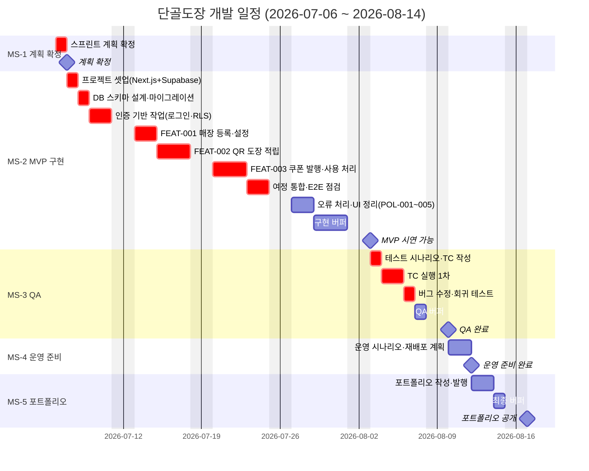

# 단골도장 간트차트

기준 문서: `milestones.md` v1.0 · 기간 2026-07-06 ~ 2026-08-14 (주말 제외, 근무일 30일, 버퍼 5일 포함)

- 크리티컬 패스: t1→t2→t3→t4→t5→t6→t7→t8→t10→t11→t12 (`crit` 마킹).
- 버퍼 3개(b1 3d, b2 1d, b3 1d) = 근무일의 16.7%.
- 주말 제외(`excludes weekends`): 1인 사이드 프로젝트지만 지속 가능성을 위해 주말은 계획에서 제외하고, 지연 시 버퍼로 흡수한다.
