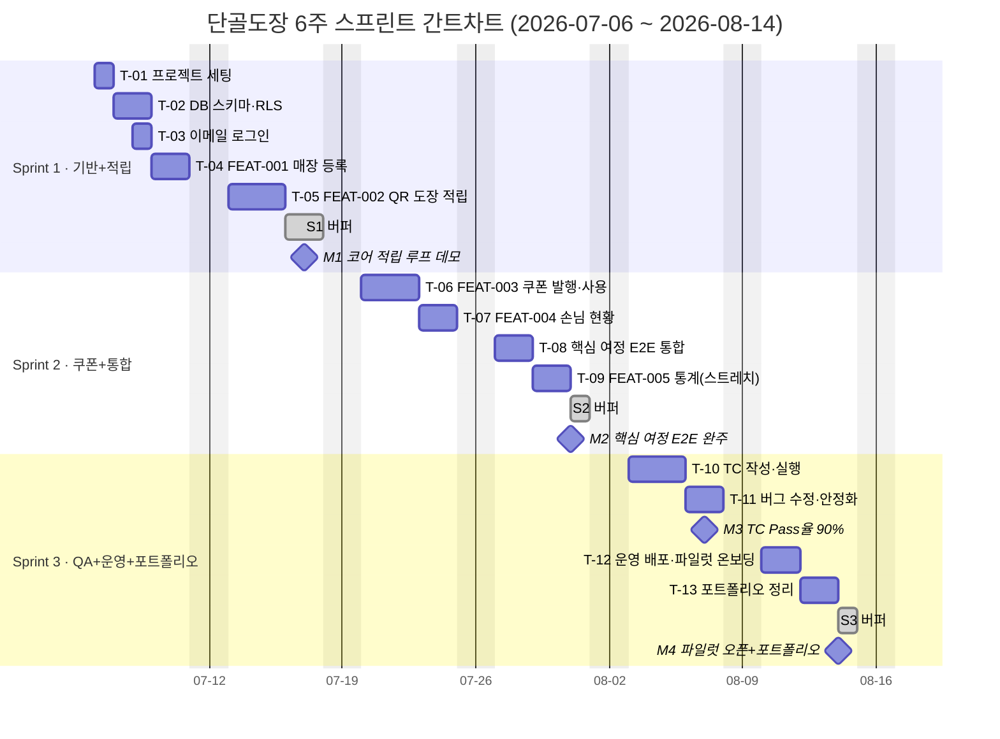

# 단골도장 스프린트 계획서 (4단계)

| 문서 버전 | 작성일 | 기반 문서 | 상태 |
|---|---|---|---|
| v1.0 | 2026-07-04 | functional-spec.md v1.0 | Draft |

## 1. 계획 개요

- **기간**: 2026-07-06(월) ~ 2026-08-14(금), 총 6주
- **스프린트 구조**: 2주 × 3개 스프린트
- **팀**: 1인 (기획·개발·QA 겸임)
- **가용 시간(캐파)**: 주 5일 × 6주 = 30 작업일. 1인 겸임 특성상 각 스프린트에 **15~20% 버퍼**를 반영해 실질 계획 캐파는 스프린트당 8.5일(총 25.5일)로 산정
- **범위**: 5단계 구현 후보 ★ 4개(FEAT-001~004) = Must 커버. FEAT-005(Should)는 스트레치 골, FEAT-006은 백로그 유지

### 성공 기준과의 연결
| 성공 기준 | 대응 계획 |
|---|---|
| 발행→적립→사용 여정 5분 내 완주 | Sprint 2 종료 시 E2E 여정 통합 완료(M2) |
| 핵심 여정 TC Pass율 90% 이상 | Sprint 3 전반 QA 라운드에서 측정·수정(M3) |

## 2. 마일스톤

| ID | 마일스톤 | 날짜 | 판정 기준 |
|---|---|---|---|
| M1 | 코어 적립 루프 데모 | 2026-07-17(금) | 매장 등록 후 QR 스캔→도장 적립까지 동작 |
| M2 | 핵심 여정 E2E 완주 | 2026-07-31(금) | 발행→적립→사용 여정을 5분 내 완주 가능 |
| M3 | QA Pass율 90% 달성 | 2026-08-07(금) | 핵심 여정 TC Pass율 ≥ 90% |
| M4 | 파일럿 오픈 + 포트폴리오 완성 | 2026-08-14(금) | 운영 배포 + 포트폴리오 문서 완료 |

## 3. 스프린트별 계획

### Sprint 1 — 기반 구축 + 적립 루프 (2026-07-06 ~ 2026-07-17)

> **스프린트 골**: 사장님이 매장을 등록하고, 손님이 QR로 도장을 적립할 수 있다. (M1)

| ID | 작업 | 관련 FEAT/정책 | 공수 | 일정 |
|---|---|---|---|---|
| T-01 | 프로젝트 세팅 (Next.js + Supabase, Vercel 배포 파이프라인) | - | 1.0d | 07-06 |
| T-02 | DB 스키마 설계·마이그레이션 (stores, customers, stamps, coupons) + RLS | - | 1.5d | 07-07 ~ 07-08 |
| T-03 | 이메일 로그인 (Supabase Auth) | FEAT-001 | 1.0d | 07-08 ~ 07-09 |
| T-04 | 매장 등록·적립 정책 설정 (SCR-001/002, POL-001 중복 매장명) | FEAT-001 ★ | 2.0d | 07-09 ~ 07-13 |
| T-05 | QR 생성·스캔 적립 플로우 (SCR-003, POL-002 하루 중복 제한, POL-003 잘못된 QR) | FEAT-002 ★ | 3.0d | 07-13 ~ 07-16 |
| - | 버퍼 | - | 1.5d | 07-16 ~ 07-17 |

계획 공수 8.5d / 캐파 10d

### Sprint 2 — 쿠폰 루프 완성 + E2E 통합 (2026-07-20 ~ 2026-07-31)

> **스프린트 골**: 도장이 차면 쿠폰이 발행되고 사용 처리까지 되는, 핵심 여정 전체가 이어진다. (M2)

| ID | 작업 | 관련 FEAT/정책 | 공수 | 일정 |
|---|---|---|---|---|
| T-06 | 쿠폰 자동 발행·사용 처리 (SCR-004, POL-004 재사용 방지, POL-005 만료) | FEAT-003 ★ | 3.0d | 07-20 ~ 07-22 |
| T-07 | 손님용 적립 현황 페이지 (SCR-005, 미등록 번호 안내) | FEAT-004 ★ | 2.0d | 07-23 ~ 07-24 |
| T-08 | 핵심 여정 E2E 통합 점검 (발행→적립→사용 5분 완주 검증, UX 보정) | 여정 전체 | 1.5d | 07-27 ~ 07-28 |
| T-09 | (스트레치) 사장님 통계 대시보드 (SCR-006) | FEAT-005 | 2.0d | 07-28 ~ 07-30 |
| - | 버퍼 | - | 1.5d | 07-30 ~ 07-31 |

계획 공수 8.5d / 캐파 10d — **T-09는 T-06~08 완료 후 여유가 있을 때만 착수**. 밀리면 즉시 드롭하고 버퍼로 전환.

### Sprint 3 — QA·운영·포트폴리오 (2026-08-03 ~ 2026-08-14)

> **스프린트 골**: TC Pass율 90%를 달성하고, 파일럿 매장에 배포하며, 포트폴리오를 완성한다. (M3, M4)

| ID | 작업 | 대응 단계 | 공수 | 일정 |
|---|---|---|---|---|
| T-10 | TC 작성·실행 (핵심 여정 + 정책 POL-001~005 오류 케이스) | 6단계 QA | 3.0d | 08-03 ~ 08-05 |
| T-11 | 버그 수정·안정화 (2차 TC 재실행 포함, Pass율 90% 판정) | 6단계 QA | 2.0d | 08-06 ~ 08-07 |
| T-12 | 운영 준비: 프로덕션 배포, 에러 모니터링, 파일럿 매장 1곳 온보딩 | 7단계 Ops | 2.0d | 08-10 ~ 08-11 |
| T-13 | 포트폴리오 정리 (문제정의→성과 스토리, 스크린샷·지표 정리) | 8단계 | 2.0d | 08-12 ~ 08-13 |
| - | 버퍼 | - | 1.0d | 08-14 |

계획 공수 9.0d / 캐파 10d

## 4. 간트차트

> 렌더링 가능한 시각화 버전: `docs/04-sprint-plan/gantt-chart.html` (브라우저에서 바로 열림)

## 5. 의존 관계

- T-01 → T-02 → (T-03, T-04) → T-05 : 인프라·스키마가 모든 기능의 선행 조건
- T-05(적립) → T-06(쿠폰 발행) : 쿠폰은 도장 적립 데이터에 의존
- T-06, T-07 → T-08(E2E 통합) → T-10(QA)
- T-11(안정화) → T-12(운영 배포) → T-13(포트폴리오)

## 6. 완료 정의 (DoD)

- 기능 작업(T-04~T-07): 정상 플로우 + 명세된 오류 정책(POL) 동작, 모바일 뷰 확인, 프리뷰 배포 완료
- QA(T-10~T-11): TC 목록 문서화, Pass/Fail 기록, Pass율 산출
- 운영(T-12): 프로덕션 URL 접근 가능, 에러 모니터링 알림 수신 확인

## 7. 리스크와 대응

| 리스크 | 영향 | 대응 |
|---|---|---|
| 1인 겸임으로 가용 시간 변동 | 일정 지연 | 스프린트당 1~1.5d 버퍼 + 스트레치(T-09) 우선 드롭 |
| QR 스캔 UX가 예상보다 복잡 (카메라 권한, 브라우저 편차) | T-05 지연 | 1차는 QR→URL 접속 방식으로 단순화, 네이티브 스캔은 후순위 |
| POL-002(하루 중복 제한) 등 정책 엣지 케이스 누락 | QA Pass율 미달 | Sprint 3 초반 TC에 정책별 오류 케이스를 필수 포함 |
| 파일럿 매장 섭외 지연 | M4 지연 | Sprint 2 중 미리 후보 매장 접촉 시작 |

## 8. 백로그 (이번 6주 범위 외)

| 항목 | 사유 |
|---|---|
| FEAT-006 재방문 유도 알림 | 채널 비용, MVP 검증에 불필요 (2단계 결정: Could 강등) |
| FEAT-005 통계 대시보드 (스트레치 미착수 시) | Must 4개 완성이 우선 |
